# Backend Developer Interview Q&A

> Covers: Next.js, Express.js, Node.js, PostgreSQL, Redis, Security (OWASP), REST APIs, CI/CD, Docker, Message Queues

---

## 1. Next.js Backend Features

### Q1. What are Next.js API routes and how do they differ from a standalone Express server?

**Answer:**
API routes in Next.js live under `pages/api` (or `app/api` in the App Router) and are serverless by default — each file exports a handler function. Unlike Express, there's no single long-running process; each route is isolated. This makes them easy to deploy on Vercel or AWS Lambda but means you can't share in-memory state across routes. For stateful needs (DB connection pools, caches), you lift state to module scope with a singleton pattern or use an external store like Redis.

---

### Q2. How does middleware work in Next.js, and what are its limitations?

**Answer:**
Next.js Middleware runs at the Edge before a request reaches a page or API route. You export a `middleware` function from `middleware.ts` at the project root. It can rewrite URLs, set response headers, redirect, or block requests. The key limitation is the Edge runtime: no Node.js APIs (no `fs`, no native modules), limited CPU time, and no direct DB access. Heavy logic belongs in API routes, not middleware.

---

### Q3. Explain server-side rendering (SSR) in Next.js and when you'd choose it over static generation.

**Answer:**
SSR (`getServerSideProps` in Pages Router, or a Server Component that fetches on each request in App Router) renders HTML on every request, so the page always reflects the latest data. Choose SSR when content changes frequently (dashboards, user-specific pages) or when you need request-time data (auth cookies, geolocation). Choose static generation (SSG) for content that rarely changes (marketing pages, docs) — it's faster because the HTML is pre-built and served from a CDN.

---

### Q4. How do you implement authentication in Next.js API routes?

**Answer:**
A common approach is to use `NextAuth.js` for OAuth/credential-based flows, or implement JWT manually. In App Router, you read cookies or authorization headers in the route handler, verify the JWT signature using a secret, and extract the user payload. Middleware can protect entire route groups by checking the token early — before the route handler even runs. For server components, you can call `getServerSession()` from `next-auth` to access session data directly on the server.

---

### Q5. What is the difference between the Pages Router and the App Router in Next.js?

**Answer:**
The Pages Router uses a file-based routing system under `pages/` with `getServerSideProps`, `getStaticProps`, and `getStaticPaths` for data fetching. The App Router (introduced in Next.js 13) uses the `app/` directory and React Server Components by default — components fetch data directly without special lifecycle functions. The App Router supports nested layouts, streaming with Suspense, and fine-grained caching strategies. The Pages Router is more mature and stable for production; the App Router offers more flexibility and better performance but has a steeper learning curve.

---

## 2. Express.js & Node.js

### Q6. How does the Node.js event loop work, and why does it matter for backend performance?

**Answer:**
Node.js runs on a single thread with a non-blocking event loop. I/O operations (DB queries, HTTP calls, file reads) are offloaded to libuv's thread pool or the OS. When they complete, callbacks are queued and processed in phases: timers → I/O callbacks → idle/prepare → poll → check → close. This means CPU-intensive work (heavy computation, crypto) blocks the loop and starves all other requests. For CPU work, use worker threads or offload to a separate process.

---

### Q7. How do you structure an Express app for a large codebase?

**Answer:**
Use a layered architecture:
- `routes/` — HTTP layer: parse request, call controller
- `controllers/` — orchestration: no business logic
- `services/` — business logic: pure functions where possible
- `repositories/` — DB access: isolated so the ORM/query library can be swapped

Middleware handles cross-cutting concerns: auth, request logging, error handling. A central error-handler middleware catches anything thrown so controllers stay clean.

---

### Q8. How do you handle unhandled promise rejections and uncaught exceptions in Node.js?

**Answer:**
Register `process.on('unhandledRejection', ...)` and `process.on('uncaughtException', ...)`. For uncaught exceptions, log the error and exit — the process is in an unknown state and should be restarted by the process manager (PM2, systemd, Kubernetes). In Express, use an async wrapper or a library like `express-async-errors` to ensure rejected promises propagate to the global error-handler middleware.

---

### Q9. What is the difference between `process.nextTick`, `setImmediate`, and `setTimeout` in Node.js?

**Answer:**
- `process.nextTick(cb)` — fires before the event loop proceeds to the next phase; highest priority, runs after the current operation completes
- `setImmediate(cb)` — fires in the check phase of the event loop, after I/O callbacks
- `setTimeout(cb, 0)` — fires in the timers phase; the 0ms delay is a minimum, not a guarantee

Use `process.nextTick` for deferring work within the same iteration; use `setImmediate` when you want to yield to I/O first. Overusing `process.nextTick` can starve the event loop if callbacks keep adding more nextTick callbacks.

---

### Q10. What are streams in Node.js and when would you use them?

**Answer:**
Streams process data in chunks rather than loading it all into memory. There are four types: Readable, Writable, Duplex (both), and Transform (Duplex that modifies data). Use streams for: reading large files, proxying HTTP responses, processing CSV imports, or compressing data on the fly with `zlib`. Instead of `fs.readFile` (loads entire file into memory), use `fs.createReadStream` piped to a response object. This keeps memory usage flat regardless of file size.

---

### Q11. Explain how Express error-handling middleware works.

**Answer:**
Express identifies an error-handling middleware by its 4-argument signature: `(err, req, res, next)`. Any middleware or route handler that calls `next(err)` — or throws inside an async wrapper — passes control directly to this handler, skipping remaining route handlers. Best practice: have a single global error handler at the bottom of the middleware stack that logs the error, maps it to an HTTP status code, and returns a consistent JSON error response. Operational errors (invalid input, not found) get 4xx; unexpected errors get 500.

---

## 3. PostgreSQL

### Q12. Walk me through how you'd optimize a slow PostgreSQL query.

**Answer:**
Start with `EXPLAIN ANALYZE` to see the actual execution plan and identify sequential scans or nested loops on large sets. Common fixes:
- Add an index on columns in `WHERE`, `JOIN`, or `ORDER BY` clauses
- Rewrite correlated subqueries as JOINs or CTEs
- Use partial indexes for filtered queries
- Break up large queries into smaller, indexed steps

After changes, run `EXPLAIN ANALYZE` again to verify the planner picks the new path. Also check `pg_stat_user_tables` for bloat and run `VACUUM ANALYZE` if statistics are stale.

---

### Q13. What's the difference between B-tree, GIN, and GiST indexes in PostgreSQL?

**Answer:**
- **B-tree** (default) — handles equality and range comparisons on scalar types; the right choice for most columns
- **GIN** (Generalized Inverted Index) — designed for composite values like arrays, JSONB, and full-text search `tsvector`; indexes each element separately
- **GiST** (Generalized Search Tree) — supports geometric types, ranges, and nearest-neighbor searches (PostGIS)

Choosing the wrong index type means PostgreSQL ignores it even if it exists.

---

### Q14. How do you design a schema migration strategy for a production database?

**Answer:**
Use a migration tool (Flyway, Liquibase, or `node-pg-migrate`) so every schema change is versioned, ordered, and repeatable. For zero-downtime migrations:
1. Deploy a backward-compatible migration (e.g., add a nullable column)
2. Deploy the app code that uses it
3. Tighten constraints in a follow-up migration

Never rename a column or drop one in the same deploy as the code change. Always test migrations on a staging DB first. Keep rollback scripts for emergency use.

---

### Q15. Explain MVCC (Multi-Version Concurrency Control) in PostgreSQL.

**Answer:**
PostgreSQL never overwrites rows in place. Each `UPDATE` writes a new row version (tuple) and marks the old one expired with an `xmax` transaction ID. Readers see only tuples whose `xmin` is committed and `xmax` is not — so reads never block writes and writes never block reads. Dead tuples accumulate until `VACUUM` reclaims them. Long-running transactions cause table bloat: they prevent VACUUM from cleaning up rows they might still need to see.

---

### Q16. What are database transactions and what are the ACID properties?

**Answer:**
A transaction is a unit of work that either fully completes or fully rolls back. ACID stands for:
- **Atomicity** — all operations succeed or none do
- **Consistency** — the DB transitions from one valid state to another; constraints are enforced
- **Isolation** — concurrent transactions don't interfere; controlled by isolation levels (Read Committed, Repeatable Read, Serializable)
- **Durability** — committed data survives crashes (written to WAL before acknowledging)

PostgreSQL defaults to Read Committed isolation. For financial operations or anything requiring repeatable reads, use `BEGIN; SET TRANSACTION ISOLATION LEVEL REPEATABLE READ;`.

---

### Q17. What is connection pooling and why is it important for PostgreSQL?

**Answer:**
PostgreSQL spawns a new OS process per connection — each costs ~5MB RAM and setup time. In a high-traffic Node.js app, opening a new connection per request is expensive and can exhaust `max_connections`. A connection pool (e.g., `pg-pool` in Node, or PgBouncer externally) maintains a fixed set of open connections and queues requests when all connections are in use. Configure pool size based on: `max_connections / number_of_app_instances`, leaving headroom for migrations and admin queries. PgBouncer in transaction mode can serve thousands of app connections over a small DB pool.

---

### Q18. Explain the difference between `INNER JOIN`, `LEFT JOIN`, and `FULL OUTER JOIN`.

**Answer:**
- `INNER JOIN` — returns only rows with matching values in both tables
- `LEFT JOIN` — returns all rows from the left table; unmatched rows from the right table return `NULL`
- `RIGHT JOIN` — the mirror of LEFT JOIN
- `FULL OUTER JOIN` — returns all rows from both tables; unmatched sides return `NULL`

Use `LEFT JOIN` when the right-side record is optional (e.g., user with or without a profile). Use `INNER JOIN` when both sides must exist. `FULL OUTER JOIN` is rare — useful for comparing two datasets to find differences.

---

## 4. Redis

### Q19. How would you implement caching with Redis in a Node.js API, and how do you handle cache invalidation?

**Answer:**
On a cache miss, fetch from the DB, serialize to JSON, and call `SET key value EX ttl`. On subsequent requests, `GET key` returns the cached value. For invalidation:
- **TTL-based** — works for data that can be slightly stale
- **Event-based** — delete or update the key on write for strong consistency

Use key namespacing like `user:{id}:profile` to make bulk invalidation easy with `SCAN` + `DEL`. Patterns: cache-aside (app manages reads/writes), write-through (write to cache and DB together), or write-behind (async flush).

---

### Q20. How does Redis handle session storage, and what are the trade-offs vs. a DB-backed session?

**Answer:**
Redis stores sessions as hashes or strings keyed by session ID with a TTL. Reads are O(1) and happen in memory — far faster than a DB query on every authenticated request. Trade-offs:
- Redis data can be lost if persistence isn't configured (use AOF or RDB snapshots for durability)
- For critical sessions, configure Redis persistence or use a DB fallback
- For horizontal scaling, use a shared Redis instance (not one per server)

---

### Q21. What Redis data structures would you use for a leaderboard, a rate limiter, and a pub/sub system?

**Answer:**
- **Leaderboard** — `ZADD` / `ZRANGE` with a Sorted Set; score = points, member = user ID. `ZREVRANGE` returns top-N in descending order in O(log N)
- **Rate limiter** — `INCR` + `EXPIRE` on a key like `ratelimit:{ip}:{minute}`. If the counter exceeds the limit within the TTL window, reject the request. Use a Lua script for atomicity
- **Pub/Sub** — `PUBLISH` to a channel, `SUBSCRIBE` to receive. Useful for real-time notifications. Note: Redis pub/sub is fire-and-forget — messages are lost if the subscriber is offline. For reliability, use Redis Streams instead

---

## 5. Backend Security (OWASP)

### Q22. What is SQL injection and how do you prevent it?

**Answer:**
SQL injection happens when user input is concatenated directly into a SQL string, letting an attacker alter the query structure. Prevention: always use parameterized queries:

```js
pool.query('SELECT * FROM users WHERE id = $1', [userId])
```

Never interpolate user input into query strings. ORMs and query builders (Drizzle, Knex, Prisma) parameterize automatically, but raw query escape hatches bypass that protection — treat them as dangerous and audit their usage.

---

### Q23. How do you prevent broken authentication in a REST API?

**Answer:**
- Use short-lived JWTs (15–60 min) with refresh tokens stored in HttpOnly cookies
- Hash passwords with bcrypt (cost factor 12+) — never MD5 or SHA-1
- Rate-limit login endpoints to block brute force
- Validate JWTs on every request: check signature, issuer, audience, and expiry
- Rotate refresh tokens on use (detect token theft via rotation)
- Use HTTPS everywhere; log and alert on unusual login patterns

---

### Q24. What is OWASP Top 10 and which items are most relevant to a Node.js backend?

**Answer:**
The OWASP Top 10 is a consensus list of the most critical web security risks. Most relevant for Node.js:

| # | Risk | Node.js Mitigation |
|---|------|--------------------|
| A01 | Broken Access Control | Always check authorization, not just auth |
| A02 | Cryptographic Failures | TLS, bcrypt, avoid MD5/SHA1 |
| A03 | Injection | Parameterized queries, input validation |
| A05 | Security Misconfiguration | Disable debug mode, remove default creds |
| A06 | Vulnerable Components | `npm audit`, pin dependencies |
| A07 | Auth Failures | JWT best practices, MFA |
| A09 | Security Logging Failures | Structured logs, anomaly alerting |

---

### Q25. How do you prevent Cross-Site Request Forgery (CSRF) in a REST API?

**Answer:**
CSRF attacks trick a browser into sending authenticated requests to your API using the victim's cookies. Mitigations:
- Use the `SameSite=Strict` or `SameSite=Lax` cookie attribute — modern browsers block cross-origin cookies
- Validate the `Origin` or `Referer` header on state-changing requests
- Use CSRF tokens (double-submit cookie pattern) for form-based flows
- REST APIs using `Authorization: Bearer` headers (not cookies) are naturally CSRF-resistant — browsers can't automatically attach custom headers cross-origin

---

### Q26. What HTTP security headers should every backend set?

**Answer:**
| Header | Purpose |
|--------|---------|
| `Strict-Transport-Security` | Force HTTPS |
| `Content-Security-Policy` | Prevent XSS / data injection |
| `X-Content-Type-Options: nosniff` | Prevent MIME-type sniffing |
| `X-Frame-Options: DENY` | Prevent clickjacking |
| `Referrer-Policy` | Control referrer leakage |
| `Permissions-Policy` | Restrict browser features |

Use the `helmet` middleware in Express to set these automatically.

---

## 6. RESTful APIs

### Q27. What makes an API truly RESTful, and what common mistakes break REST constraints?

**Answer:**
True REST requires: client-server separation, stateless requests, a uniform interface (resources identified by URIs, manipulated via standard HTTP verbs), and caching headers. Common mistakes:
- Using verbs in URLs (`/getUsers` instead of `GET /users`)
- Returning 200 for errors
- Storing session state on the server (breaks statelessness and horizontal scaling)
- Not versioning the API (`/v1/`)
- Misusing POST for reads instead of GET

---

### Q28. How do you handle API versioning and backward compatibility?

**Answer:**
- **URL versioning** (`/v1/`, `/v2/`) — most explicit and easiest to route; preferred for most cases
- **Header versioning** (`Accept: application/vnd.api.v2+json`) — cleaner but harder to test in browsers
- **Query param** (`?version=2`) — least preferred; pollutes the URL

Additive changes (new optional fields, new endpoints) are backward-compatible. Breaking changes require a new version. Communicate deprecation timelines with a `Sunset` response header.

---

### Q29. How do you design pagination for a REST API on a large dataset?

**Answer:**
Two main strategies:
- **Offset pagination** (`?page=2&limit=20`) — simple but slow on large offsets; the DB scans and discards `offset` rows
- **Cursor/keyset pagination** (`?after=<cursor>`) — uses a unique, indexed column (e.g., `id` or `created_at`) as a bookmark; constant-time regardless of dataset size; preferred for large tables

Return pagination metadata in the response: `{ data: [...], nextCursor: "...", hasMore: true }`. Cursor pagination can't jump to arbitrary pages but is more performant and stable against inserts/deletes.

---

### Q30. What is the difference between REST and GraphQL, and when would you choose each?

**Answer:**
REST exposes multiple endpoints, each returning a fixed shape. GraphQL exposes a single endpoint where the client specifies exactly what fields it needs. REST is simpler, more cacheable (GET requests are HTTP-cache friendly), and has a larger ecosystem. GraphQL shines when: clients need flexible data shapes (mobile vs. web have different needs), you want to avoid over/under-fetching, or you're aggregating multiple backend services. Choose REST for simple CRUD APIs; choose GraphQL for complex, client-driven data requirements.

---

## 7. CI/CD, Docker & Cloud

### Q31. Walk me through a CI/CD pipeline for a Node.js backend.

**Answer:**
A typical pipeline:
1. **On PR open** — lint (`eslint`), type-check (`tsc --noEmit`), unit tests, integration tests against a Dockerized PostgreSQL
2. **On merge to main** — build Docker image, tag with commit SHA, push to registry (ECR, Docker Hub)
3. **Deploy to staging** — Kubernetes rolling update or ECS task replacement
4. **Smoke tests** — health check endpoints, critical path tests
5. **Promote to production** — manual approval gate or auto-deploy if all checks pass

Secrets are injected via environment variables from a secrets manager (AWS Secrets Manager, Vault) — never baked into the image.

---

### Q32. What's the difference between Docker images and containers, and how do you minimize image size?

**Answer:**
An image is a read-only filesystem snapshot (layers). A container is a running instance with a writable layer on top. To minimize image size:
- Use a minimal base: `node:20-alpine` (~50MB vs ~900MB for the full image)
- Use multi-stage builds: build in a full image, copy only compiled output and `node_modules --production` into the final stage
- Add `.dockerignore` to exclude `.git`, tests, and dev config
- Avoid running `npm install` before `COPY`ing source — layer caching invalidates on any source change

---

### Q33. What is a Kubernetes rolling update and how does it achieve zero downtime?

**Answer:**
A rolling update gradually replaces old pods with new ones, one at a time (controlled by `maxSurge` and `maxUnavailable` settings). The load balancer routes traffic only to healthy pods — new pods are added to the pool only after their readiness probe passes. Old pods are removed only after new ones are serving traffic. Zero downtime requires: a readiness probe that accurately reflects when the app is ready, graceful shutdown handling (`SIGTERM` → drain in-flight requests → exit), and sufficient rollout time.

---

### Q34. How do you manage environment-specific configuration in a Dockerized Node.js app?

**Answer:**
Never bake environment-specific values into the image. Instead:
- Use environment variables passed at runtime (`docker run -e DB_URL=...` or Kubernetes `ConfigMap`/`Secret`)
- Use a secrets manager (AWS Secrets Manager, HashiCorp Vault) for sensitive values; fetch secrets at startup
- Use `dotenv` locally for development (`.env` file excluded from `.dockerignore`)
- Validate required env vars at startup and fail fast if any are missing — use a library like `envalid` or `zod` to parse and validate

---

## 8. Message Queues (RabbitMQ / Kafka)

### Q35. When would you use a message queue instead of a direct API call?

**Answer:**
Use a queue when:
- The consumer is slower than the producer (queue absorbs bursts)
- The operation is async and the caller doesn't need an immediate result (email sending, PDF generation, webhook delivery)
- You need reliability guarantees (at-least-once delivery with dead-letter queues)
- You want to decouple services so a downstream failure doesn't cascade upstream
- Kafka adds ordered, replayable event streams — useful for audit logs, event sourcing, or fan-out to multiple consumers

---

### Q36. What is the difference between RabbitMQ and Kafka?

**Answer:**
| Feature | RabbitMQ | Kafka |
|---------|----------|-------|
| Model | Push (broker → consumer) | Pull (consumer → broker) |
| Message retention | Deleted after ack | Retained for configurable period |
| Ordering | Per-queue | Per-partition |
| Throughput | Moderate (tens of thousands/sec) | Very high (millions/sec) |
| Use cases | Task queues, RPC, notifications | Event streaming, audit logs, CQRS |
| Consumer groups | Competing consumers share a queue | Each group reads independently |

Choose RabbitMQ for job queues and notifications. Choose Kafka for event streaming, audit trails, or when multiple consumers need to replay the same events.

---

### Q37. How do you handle message failures and dead-letter queues?

**Answer:**
When a consumer fails to process a message (throws an exception), it can:
1. **Nack (negative acknowledge)** — requeue the message for retry
2. After N retries, route to a **dead-letter queue (DLQ)** — a separate queue for failed messages

DLQ messages are inspected manually or by an automated process to determine the cause of failure and either reprocess or discard them. In Kafka, implement retry topics (`topic.retry`, `topic.dead`) with increasing delays (exponential backoff). Always include the original message metadata (retry count, first failure timestamp, error reason) in the DLQ message for debugging.

---

### Q38. What is at-least-once vs. exactly-once delivery, and how do you handle duplicates?

**Answer:**
- **At-most-once** — message may be lost; consumer acks before processing
- **At-least-once** — message is never lost; consumer acks after processing; duplicates possible on retry
- **Exactly-once** — message is processed exactly once; requires coordination between producer, broker, and consumer (Kafka transactions, idempotent producers)

Exactly-once is complex and expensive. In practice, design consumers to be **idempotent**: processing the same message twice produces the same result. Use a deduplication key (message ID stored in Redis or DB) to detect and skip already-processed messages.

---

## 9. System Design & Architecture

### Q39. How would you design a rate limiter for an API?

**Answer:**
Common algorithms:
- **Fixed window** — count requests per time window; simple but allows burst at window boundaries
- **Sliding window log** — store timestamps of each request; accurate but memory-intensive
- **Token bucket** — tokens added at a fixed rate; consume one per request; allows controlled bursts
- **Leaky bucket** — requests processed at a fixed rate; excess is queued or dropped

Implementation: use Redis `INCR` + `EXPIRE` for fixed window, or `ZADD`/`ZREMRANGEBYSCORE` for sliding window log. Apply per user ID, per IP, or per API key. Return `429 Too Many Requests` with a `Retry-After` header when the limit is exceeded.

---

### Q40. How would you design a background job system in Node.js?

**Answer:**
Core components:
- **Job queue** — Redis-backed (BullMQ is the standard), or a dedicated broker (RabbitMQ)
- **Workers** — separate Node.js processes that pull jobs and execute them; run multiple workers for parallelism
- **Scheduler** — cron-like scheduling for recurring jobs (BullMQ supports `repeat` options)
- **Monitoring** — a dashboard (Bull Board) to view queued, active, completed, and failed jobs

Design considerations: idempotent job handlers, dead-letter handling for failed jobs, job priority levels, graceful worker shutdown (finish the current job before exiting on SIGTERM), and horizontal scaling by running multiple worker instances.

---

### Q41. How do you approach database read scaling?

**Answer:**
As read traffic grows:
1. **Add read replicas** — PostgreSQL streaming replication; direct read queries to replicas, writes to primary
2. **Caching** — Redis cache for hot, frequently-read data; reduces replica load
3. **Query optimization** — indexes, query restructuring, materialized views for expensive aggregations
4. **Connection pooling** — PgBouncer to reduce connection overhead across many app instances
5. **Partitioning** — for very large tables, range or list partitioning so queries scan only relevant partitions

Avoid premature scaling — optimize queries and add indexes first before introducing replicas or sharding.

---

### Q42. What strategies do you use for API error handling and returning consistent error responses?

**Answer:**
Define a standard error response shape:
```json
{
  "status": 400,
  "code": "VALIDATION_ERROR",
  "message": "email is required",
  "details": [{ "field": "email", "issue": "required" }],
  "requestId": "abc-123"
}
```

Practices:
- Use a custom `AppError` class with `statusCode` and `code` fields
- Centralize error mapping in Express's global error handler
- Distinguish operational errors (4xx — safe to expose) from programmer errors (5xx — log internally, return generic message)
- Always include a `requestId` for traceability across logs
- Use `zod` or `joi` for input validation and map schema errors to 400 responses automatically

---

*Total: 42 Questions across 9 topic areas*

---

## FAQ

### PgBouncer vs node pg pool. Which one should use and when?



**`node-postgres` pool** lives inside your Node.js process. Each instance of your app maintains its own set of real PostgreSQL connections. It's zero-config, fast to set up, and works great for a single-server deployment. The problem: if you run 10 app instances each with a pool of 20, you've just opened 200 real connections to PostgreSQL — which has a hard `max_connections` limit (default 100). Restart an instance, and all its pooled connections close and re-open, causing a spike.

**PgBouncer** is an external proxy that sits between your apps and PostgreSQL. All your app instances connect to PgBouncer using "virtual" connections, and PgBouncer maps them to a small fixed set of real DB connections. It doesn't care how many app servers you spin up — the DB only ever sees PgBouncer's pool. It also survives app restarts cleanly.

---

**When to use each:**

Use `node-postgres` pool when you have a single server or a small number of instances, you want simplicity, and your pool size stays comfortably under PostgreSQL's `max_connections`. It handles 95% of use cases with zero operational overhead.

Use PgBouncer when you're running many app instances (containers, Lambda, Kubernetes pods), your total connection count is approaching PostgreSQL's limit, or you're on a managed DB like RDS that charges per connection. PgBouncer's transaction mode is particularly powerful — it checks out a real connection only for the duration of a transaction, then returns it to the pool immediately.

**One gotcha with PgBouncer's transaction mode:** some PostgreSQL features don't work — specifically `SET` session variables, named prepared statements, and advisory locks — because the underlying connection isn't guaranteed to be the same across statements. If your code relies on those, you need session mode (which behaves more like `pg-pool` but still gives you the cross-instance sharing benefit).

The common production pattern is to use **both**: `pg-pool` inside each app instance (small pool, say 5–10), pointing at PgBouncer rather than directly at PostgreSQL. You get the best of both — low latency from in-process pooling, and a stable, bounded connection count at the DB level.
